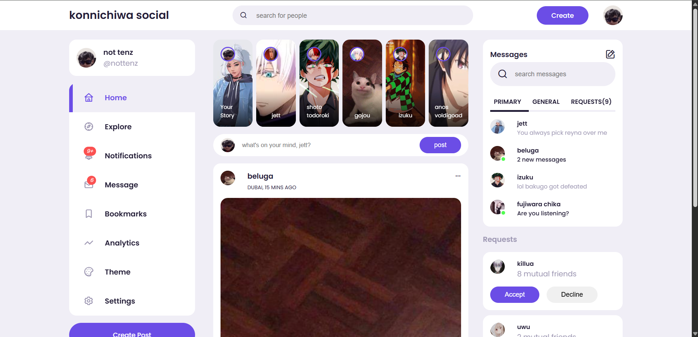
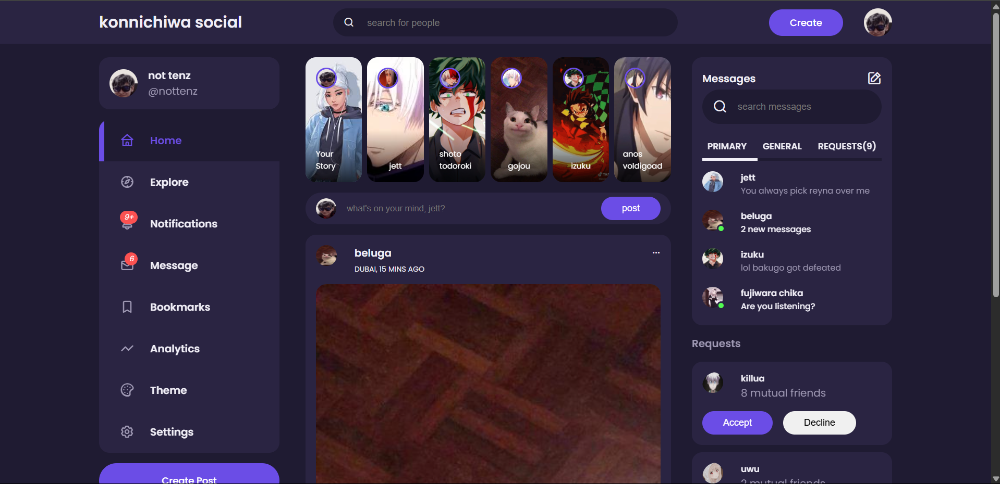
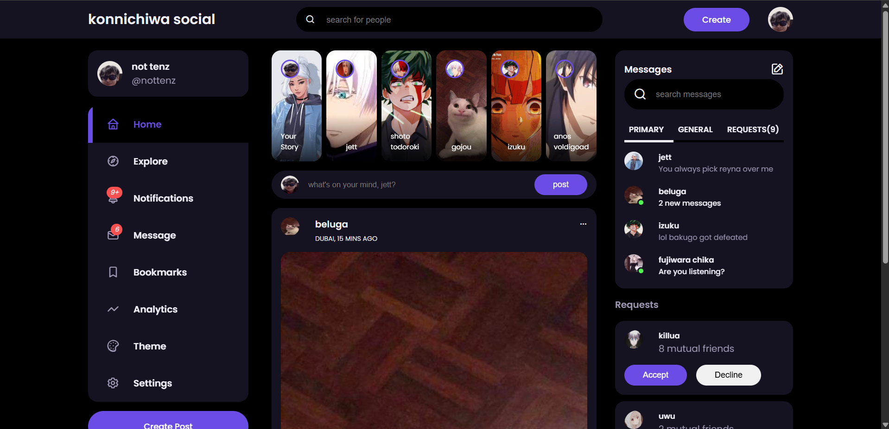
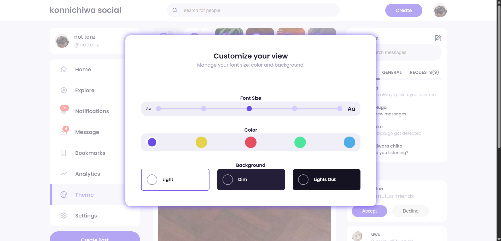

# 🌐 Social Media UI Settings (Showcase)

A responsive **frontend-only** concept simulating a social media settings panel.  
Built with **HTML**, **CSS**, and **JavaScript**, this UI/UX demo lets users explore features like dark mode, theme colors, and font size adjustments — all without any frameworks.

> ⚠️ This repository contains **only media & documentation** for showcase purposes.  
> The source code is private and not available for cloning, reuse, or redistribution.

---

## 🚀 Live Demo

- 🔗 [GitHub Pages](https://mohitmehtre.github.io/socialmedia-ui-settings/)
- 🔗 [Netlify](https://konnichiwa-social-live.netlify.app/)

---

## 📸 Preview

### 🌞 Light Mode  

---

### 🌘 Dim Mode  

---

### 🌚 Lights Out Mode  

---

### 🎨 Settings Modal  

---

## ✨ Highlights

- Toggle between **Light**, **Dim**, and **Lights Out** modes  
- Choose from multiple **theme colors**  
- Change **font sizes** for better accessibility  
- Switch between **light/dark modal backgrounds**  
- Fully responsive layout  
- Built with **pure HTML, CSS, and JavaScript** (no frameworks)

---

## 🧠 Tech Stack

- HTML5  
- CSS3  
- JavaScript (Vanilla JS)  
- Shadcn UI (for styling components)

---

## 🙋‍♂️ Author

**Mohit Mehtre**  
📍 [GitHub Profile](https://github.com/mohitmehtre)
